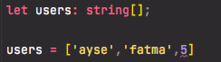

# Arrays \(Diziler\)

**TypeScript** ile **array** içindeki elemanların tip tanımlamasını yaparken aşağıdaki gibi yapabiliriz.

```typescript
let users: string[];
```

**Array** içerisindeki elemanlarımızın tiplerinin **string** olacağını tanımladık.



şeklinde yazdığımızda **5** değeri **number** olduğu için hata vericektir.


**Array** için tip tanımlamasının yapmanın bir başka yolu ise [generic](generics.md) olarak tip tanımlamasıdır.

```typescript
let list: Array<number> = [1, 2, 3];
```


