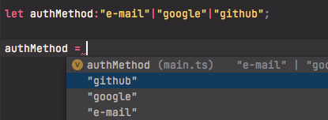

# Custom Types \(Özel Tipler\)

Örneğin **authMethod** isimli bir değişkeniniz var ve bu değişkenin sadece e-mail, google ve github değerlerini almasını istiyorsunuz. İşte tam bu durumda **TypeScript** in **custom types** özelliği yardımımıza koşuyor.

```typescript
let authMethod:"e-mail"|"google"|"github";

authMethod = "google"
```

Ayrıca TypeScript in intellisense e kattığı özellik sayesinde öneriler kısmına custom tip tanımlamalarımız geliyor.



