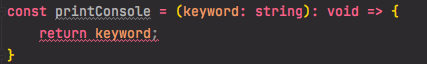

# Fonksiyonlar

### Parametre Tipleri

**TypeScript** ile oluşturduğumuz fonksiyonların parametrelerinin tiplerini aşağıdaki gibi belirleyebiliriz. Ayrıca [type](type.md) ve [interface](interfaces.md) sayfalarında diğer yöntemleri de kullanabiliriz.

Aşağıdaki gibi fonksiyonumuzun parametre tiplerini belirtebiliriz.

```typescript
const add = (num1: number, num2: number) => {
    return num1 + num2;
}
add(2, 3)
```

### Fonksiyonun Dönüş Değeri

Fonksiyonumuzun döndüreceği değer önemli olduğu taktirde, aşağıdaki gibi fonksiyon parantezlerinin sonuna **`:type`** ile fonksiyonumuzun dönüş değerini tanımlayabiliriz.

```typescript
const add = (num1: number, num2: number): number => {
    return num1 + num2;
}
let sum: number;
sum = add(3, 2)
```

Fonksiyonumuz herhangi bir değer döndürmüyorsa, **void** ile değer dönmediğimizi belirtebiliriz.

```typescript
const printConsole = (keyword: string): void => {
    console.log(keyword)
}
```

Dönüş değeri olarak **void** belirlediğimiz bir fonksiyondan dönüş yaptığımız takdirde hata alırız.




Dönüş değeri **void** olarak belirlediğimiz fonksiyonlarda kullanılan return fonksiyondan çıkış amaçlı kullanıldıysa hata vermez.


### Default parametreler

Fonksiyonumuzun parametrelerinde default parametre kullanmak istersek aşağıdaki örnekteki gibi **`parametreIsmi: parametreTipi = defaultParametre`** şeklinde default değer atayabiliriz.

```typescript
const add = (num1: number, num2: number = 4) => {
    return num1 + num2;
}
add(2)
```

### **Rest Parametreler**

Rest operatörü ile parametre tanımladığımızda, rest öğelerin tiplerini array tip tanımlaması yaptığımız gibi yapabiliriz.

Aşağıdaki örnekte fonksiyonumuzda rest operatörü kullandığımızda nasıl tip tanımlaması yaptığımızı görebilirsiniz.

```typescript
function Greet(greeting: string, ...names: string[]) {
    return greeting + " " + names.join(", ") + "!";
}

Greet("Hello", "Steve", "Bill"); // returns "Hello Steve, Bill!"

Greet("Hello");// returns "Hello !"
```


